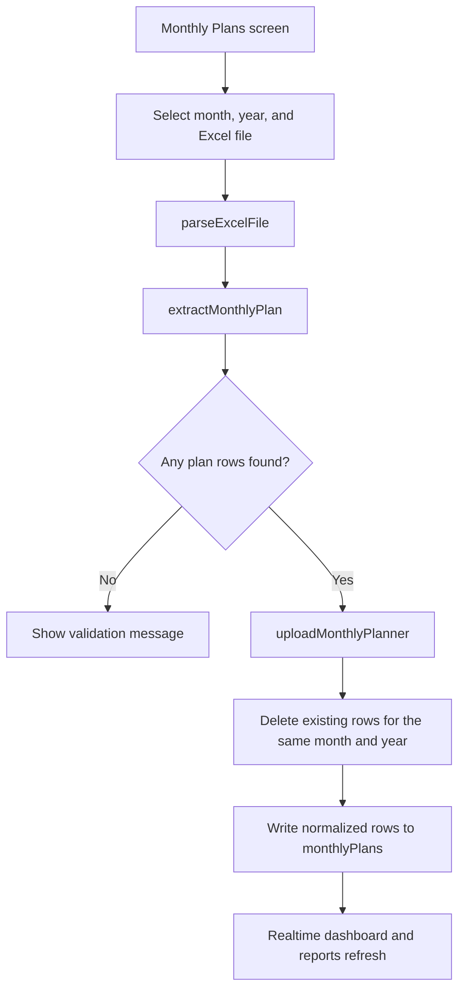
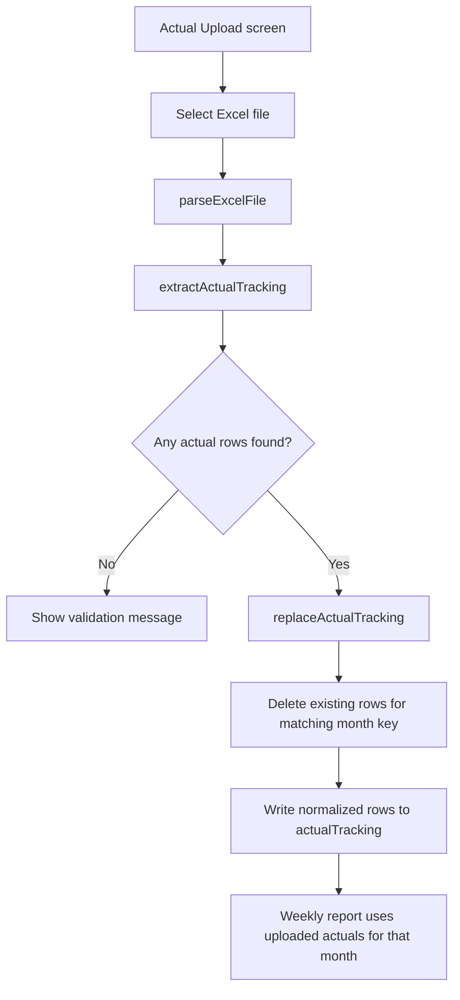
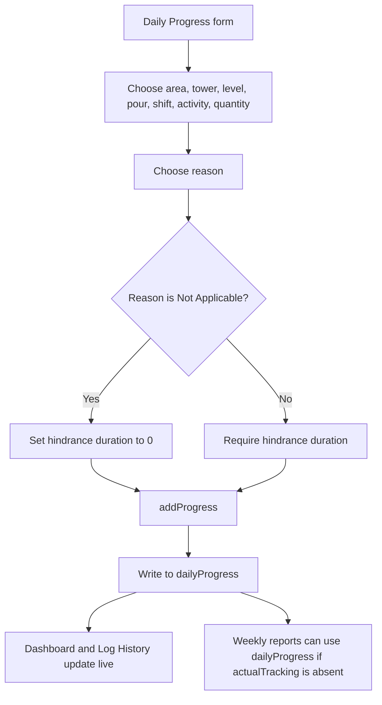
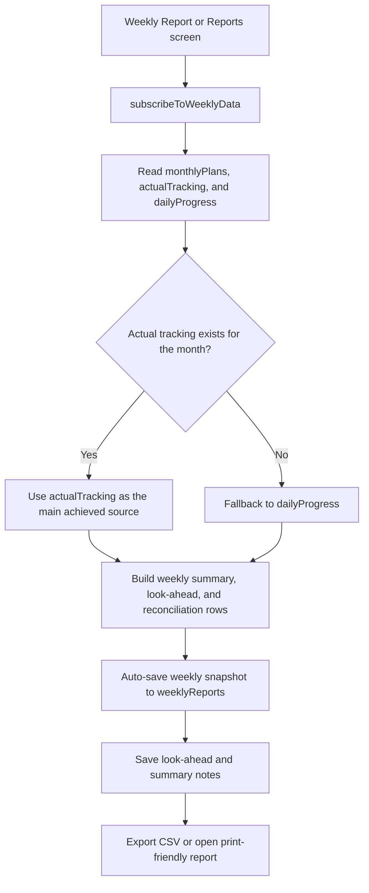

# Leighton SiteSync

Leighton SiteSync is a Firebase-backed construction planning and progress control app for the Leighton project team. It brings together monthly planning, daily progress capture, actual tracking uploads, weekly reporting, reconciliation, and exportable management reports in a single React interface.

## What This Repo Contains

- `frontend/` contains the Vite + React application.
- `backend/` is currently empty in this repository.
- Firebase Authentication and Firestore are used directly from the frontend, so there is no separate API server checked in yet.

## Tech Stack

- React 19
- Vite 8
- Tailwind CSS 3
- Firebase Auth
- Firebase Firestore
- `xlsx` for Excel parsing
- Browser CSV export and print output for reports

## Repository Layout

```text
.
+-- backend/                 # currently empty
+-- frontend/
|   +-- public/
|   +-- src/
|   |   +-- assets/
|   |   +-- components/
|   |   +-- data/
|   |   +-- pages/
|   |   +-- services/
|   |   +-- utils/
|   +-- index.html
|   +-- package.json
|   +-- README.md
+-- README.md
```

## Core Features

- Email/password login and registration through Firebase Auth.
- Role-aware access for Admin, Planner, and Site Engineer accounts.
- Live dashboard with planned vs actual totals, daily tracked totals, histogram and S-curve charts, tower bar graphs, monthly performance, and daily log reconciliation.
- Daily progress capture with tower, level, pour, shift, activity, quantity, and hindrance reason fields.
- Monthly planner Excel upload with replace-by-month behavior.
- Actual tracking Excel upload with replace-by-month behavior.
- Weekly report builder with look-ahead notes, shortfall reasons, and risk notes.
- Automatic weekly report snapshots in Firestore.
- Report center with CSV export and a browser print view that can be saved as PDF.
- Site layout reference screen for tower and area context.
- Log history browser with filters, CSV export, and role-controlled delete actions.

## Roles And Access

| Role | Main Access |
| --- | --- |
| Admin | Full access to planning, reporting, uploads, daily progress, and deletions. |
| Planner | Dashboard, monthly plans, weekly reports, report center, site layout, and deletion of progress/history items. |
| Site Engineer | Daily progress entry, actual upload, dashboard, weekly report, site layout, and read-only history views. |

## Main Screens

| Screen | Purpose | Notes |
| --- | --- | --- |
| `Dashboard` | Live performance view with KPI cards, charts, and reconciliation tables. | Reads from `monthlyPlans`, `actualTracking`, and `dailyProgress`. |
| `DailyProgress` | Capture site progress for the current day. | Validates hindrance reason and duration when the reason is not `Not Applicable`. |
| `MonthlyPlans` | Upload and manage monthly planner spreadsheets. | Replaces the rows for the same month and year. |
| `ActualUpload` | Upload and manage actual tracking spreadsheets. | Replaces the rows for the same month key. |
| `WeeklyReport` | Build weekly progress tables and notes. | Auto-saves snapshots and stores shortfall and risk notes. |
| `Reports` | Export daily, weekly, monthly, and reconciliation reports. | CSV export and print-friendly output. |
| `LogHistory` | Review historical daily progress entries. | Delete button is limited to Admin and Planner in the UI. |
| `SiteLayout` | Show site area and tower reference. | Uses the layout image and tower metadata. |
| `Home` | Role-aware module card landing screen in the codebase. | The current auth flow routes directly to a role-specific module after login. |

## Important Source Files

| File | Purpose |
| --- | --- |
| `frontend/src/App.jsx` | Auth gate and in-memory page switching. |
| `frontend/src/firebase.js` | Firebase app, Auth, and Firestore initialization. |
| `frontend/src/services/authService.js` | Login, registration, logout, and user profile creation. |
| `frontend/src/services/monthlyPlanService.js` | Monthly plan upload, archive, delete, and realtime subscriptions. |
| `frontend/src/services/actualTrackingService.js` | Actual tracking upload, delete, and realtime subscriptions. |
| `frontend/src/services/dprService.js` | Daily progress create, delete, and realtime subscriptions. |
| `frontend/src/services/weeklyReportService.js` | Weekly data aggregation, snapshots, and report persistence. |
| `frontend/src/services/reportService.js` | Report assembly for dashboard and export screens. |
| `frontend/src/services/reasonService.js` | Shortfall and risk reason storage. |
| `frontend/src/utils/excelParser.js` | Reads `.xlsx` and `.xls` files into row arrays. |
| `frontend/src/utils/extractMonthlyPlan.js` | Normalizes monthly plan workbooks into Firestore-ready rows. |
| `frontend/src/utils/extractActualTracking.js` | Normalizes actual tracking workbooks into Firestore-ready rows. |
| `frontend/src/utils/exportCsv.js` | CSV export and print-window generation. |
| `frontend/src/data/` | Towers, areas, levels, reasons, activities, and site constants. |

## How The App Works

1. The app starts by listening to Firebase Auth state.
2. If no user is signed in, the login screen is shown.
3. If a user is signed in, the app loads or creates a profile document in `users/{uid}`.
4. The user role controls the default page after login.
5. All data screens subscribe to Firestore in realtime with `onSnapshot`.
6. Upload screens parse Excel files, normalize the rows, and write the cleaned data back to Firestore.
7. Dashboard and report screens build summaries from the current Firestore data.
8. The report center exports CSV files or opens a print-friendly view that the browser can save as PDF.

## Firestore Collections

| Collection | Purpose | Common Fields |
| --- | --- | --- |
| `users` | Auth profile and role information. | `uid`, `email`, `role`, `displayName`, `createdAt`, `updatedAt` |
| `monthlyPlans` | Monthly planning rows imported from Excel. | `month`, `monthLabel`, `year`, `planId`, `planMonthKey`, `tower`, `level`, `pour`, `activity`, `plannedQuantity`, `monthPlan`, `weeklyPlan`, `cumulativePlan`, `status`, `uploadedBy`, `uploadedAt` |
| `actualTracking` | Actual tracking rows imported from Excel. | `month`, `monthLabel`, `actualMonthKey`, `monthKey`, `tower`, `level`, `pour`, `activity`, `actualQuantity`, `weeklyActual`, `source`, `uploadedAt` |
| `dailyProgress` | Daily engineer progress records. | `date`, `area`, `tower`, `level`, `pour`, `core`, `shift`, `activity`, `quantity`, `reason`, `hindranceReason`, `startDate`, `durationInDays`, `endDate`, `delayOffsetDays`, `engineerName`, `createdBy`, `createdByEmail`, `createdAt` |
| `weeklyReports` | Saved weekly report snapshots and notes. | `week`, `weekIndex`, `monthKey`, `monthLabel`, `totalPlan`, `totalAchieved`, `percentage`, `balance`, `rows`, `dataSource`, `lookAhead`, `monthlySummary`, `shortfallReason`, `riskReason`, `createdBy`, `createdAt`, `updatedAt` |
| `lookAhead` | Weekly look-ahead notes. | `week`, `monthKey`, `text`, `createdBy`, `createdAt` |
| `shortfallReasons` | Custom shortfall reason library. | `name`, `createdBy`, `createdAt` |
| `riskReasons` | Custom risk reason library. | `name`, `createdBy`, `createdAt` |

## Excel Upload Formats

### Monthly Planner Upload

- The file picker accepts `.xlsx` and `.xls`.
- The parser can read a table-style workbook with `Date`, `Tower` or `Location`, `Level` plus `Pour`, and `Quantity` columns.
- The parser can also read the concrete workbook format where `Plan` rows are extracted from the mixed plan/actual sheet.
- Imported monthly plan rows are normalized into weekly and cumulative arrays before being written to Firestore.
- Uploading a planner for the same month and year replaces the previous rows for that month.

### Actual Tracking Upload

- The file picker accepts `.xlsx` and `.xls`.
- The parser can read a day-wise workbook with `Date`, `Tower / Location`, `Level/Pour`, `Quantity`, and `Total Achieved Qty` columns.
- The parser can also read the concrete workbook format where `Actual` rows are extracted from the mixed plan/actual sheet.
- Imported actual rows are normalized into `actualQuantity` and `weeklyActual` values before being written to Firestore.
- Uploading actuals for the same month key replaces the previous rows for that month.

### Daily Progress Entry

- The app validates that a reason is selected.
- If the reason is anything other than `Not Applicable`, hindrance duration in days is required.
- The selected reason and duration drive the `endDate` and `delayOffsetDays` fields.

## Setup

1. Install a current Node.js LTS release.
2. Open the `frontend/` directory.
3. Run `npm install`.
4. Run `npm run dev` to start the Vite dev server.
5. Open the local URL printed by Vite.

## Scripts

Run these from `frontend/`.

| Script | What It Does |
| --- | --- |
| `npm run dev` | Starts the Vite development server. |
| `npm run build` | Builds the production bundle. |
| `npm run lint` | Runs ESLint across the frontend. |
| `npm run preview` | Serves the production build locally. |

## Firebase Setup Notes

- The Firebase config is currently defined in `frontend/src/firebase.js`.
- If you switch to a different Firebase project, update that file with your own credentials.
- Firebase Email/Password sign-in must be enabled in Authentication.
- Firestore security rules should match the role-based behavior enforced in the UI.
- The frontend assumes Firestore is available and reachable from the browser.

## Mermaid Flowcharts

### Authentication And Routing

```mermaid
flowchart TD
    A[Open SiteSync] --> B[Firebase auth state listener]
    B -->|No user| C[Login or Register]
    B -->|Signed in| D[Load or create users/{uid}]
    D --> E{Role}
    E -->|Site Engineer| F[Daily Progress]
    E -->|Admin or Planner| G[Dashboard]
    F --> H[App shell navigation]
    G --> H
    H --> I[Open any allowed module]
```

### Monthly Planner Upload



### Actual Tracking Upload



### Daily Progress And Reconciliation



### Weekly Reporting And Export



## Notes

- The app uses in-memory page switching in `App.jsx` instead of a router.
- `Home.jsx` exists as a module overview screen, but the current auth flow routes users directly into a role-specific module after sign-in.
- Report export uses browser-generated CSV files and a printable HTML window rather than a dedicated PDF library.
- Delete actions are hidden or blocked in the UI for unauthorized roles, and Firestore rules should enforce the same restriction.
- The `frontend/src/data/` directory holds the constant lists that drive tower, level, activity, and reason dropdowns.
